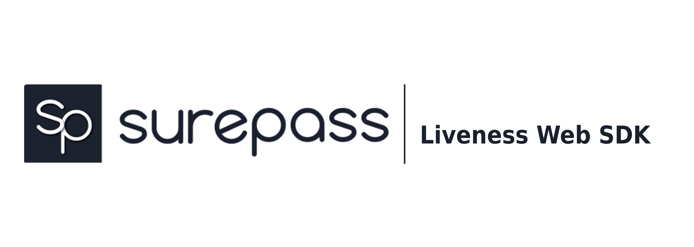

SurePass Liveness Web SDK lets you verify user easily using our face detection and other features with basic and quick setup on your desired platform, be it mobile or web application.

## Basic Overview

SurePass Liveness Web SDK provides a flexible option to integrate with your existing workflow. It can be consumed in two ways. You can add it to your flow of Liveness web sdk and then expect a redirect at the url you passed while you were initializing the token. The other option is to use an event driven approach where you can initialize it in a new browser tab (for mobile devices and desktop) or in a new window (in desktop applications) and use the callback function to move forward based on success or failure of liveness web sdk.

## Table of Contents

- [Installation](#installation)

- [Getting started](#getting-started)

- [Using redirect process](#using-redirect)

- [Using event based approach](#using-event-based-approach)

- [Basic SDK usage](#using-event-based-approach)

- [Handling the callback response](#handling-the-responses-in-callback)


## Installation

You can easily setup the SDK in your application using either of the following ways.

- **Install the Liveness Web SDK as npm package.**

```shell script

$ npm i @surepass/liveness-web-sdk --save

```

- **Directly embed the script tag in your application.**

```html
<script src="https://cdn.jsdelivr.net/gh/surepassio/surepass-liveness-web-sdk@1.1.0/lib/livenessWebSdk.min.js"></script>
```

## Getting Started

There are two ways you can integrate the liveness web SDK into your flow.

- [Using the redirect process.](#using-redirect)

- [Using events based approach.](#using-event-based-approach)

### Using redirect

To use this method you need to initialize the token providing a redirect URL.

- Redirect the user to [SurePass Liveness Web SDK](https://kyc.surepass.io/) with token in the query string which looks similar to `https://kyc.surepass.io/?liveness_token=YOUR_TOKEN`.

- On successful completion of web sdk we will redirect the user to your provided redirect URL.

**Note:** Using this approach doesn't require our supplementary package or script to be setup.

### Using event based approach

Specifying redirect URL while initializing token is completely optional. If this parameter is skipped, SurePass Liveness SDK follows event based approach.

- Make the token initialization without specifying any redirect URL.

- You may optionally use our supplementary package or make one for yourself to initiate the web sdk window with a callback function that will return the verification status. Either success or failure along with a brief message.

### Basic Usage

Following example opens a new window or tab depending on the device being used either desktop or mobile. Finally, it invokes `onSuccess` or `onError` functions depending on the status of the verification process.

#### Using npm package

```jsx
import React from "react";

import "./styles.css";

import { OpenLivenessWebSdkPopUP } from "@surepass/esign";

function openLivenessSdk(onSuccess, onError) {
  const token = "YOUR TOKEN";

  const options = {
    token,

    window_name: "Surepass",

    dimension: { width: "450", height: "850" },
  };

  const livenessSdk = new OpenLivenessWebSdkPopUP(options);

  livenessSdk.openWindow(onSuccess, onError);
}

function onSuccess(response) {
  console.log("Response", response);
}

function onError(response) {
  console.log("Error", response);
}

export default function App() {
  return (
    <div className="App">
      <button onClick={() => openLivenessSdk(onSuccess, onError)}>Call</button>
    </div>
  );
}
```

[](https://codesandbox.io/s/recursing-leftpad-4xoj6?fontsize=14&hidenavigation=1&theme=dark)

#### Using in script tag

```html
<!-- For testing using script tag -->
<!DOCTYPE html>
<html lang="en">
  <head>
    <meta charset="UTF-8" />
    <meta name="viewport" content="width=device-width, initial-scale=1.0" />
    <title>Document</title>
    <script src="https://cdn.jsdelivr.net/gh/surepassio/surepass-liveness-web-sdk@1.0.0/lib/livenessWebSdk.min.js"></script>
    <script>
        const LivenessWebSdkPopUpOpener = window.livenessWebSdk.default
      function openLivenessSdk(onSuccess, onError) {
        //  you need to paste your token here
        const token = "YOUR TOKEN HERE";
        const options = {
          token,
          window_name: "Surepass",
          dimension: { width: "450", height: "850" },
        };
        const livenessSdk = new LivenessWebSdkPopUpOpener(options);
        livenessSdk.openWindow(onSuccess, onError);
      }

      function onSuccess(response) {
        console.log("Response", response);
      }

      function onError(response) {
        console.log("Error", response);
      }

      function openPopUp(){
          openLivenessSdk(onSuccess,onError)
      }
    </script>
  </head>
  <body>
    <button onclick="openPopUp()">Open</button>
  </body>
</html>


```

[](https://codesandbox.io/s/brave-pike-8n3dm?fontsize=14&hidenavigation=1&theme=dark)

### Handling the responses in callback

SurePass Liveness SDK returns following response depending on the status of verification process.

**Note:** Only the **200 SUCCESS** status is sent to `onSuccess` function. Rest, all the other responses are dispatched to the `onError` function.

- #### 200 SUCCESS

Returns HTTP status of 200 OK, when the verifcation process has been completed successfully.

```json
{
  "data": {
    "client_id": "CLIENT_ID"
  },
  "status_code": 200,
  "message_code": "SUCCESS",
  "message": "Successfully Completed",
  "success": true
}
```

- #### 401 UNAUTHORIZED ACCESS

```json
{
  "data": {
    "client_id": "CLIENT_ID"
  },
  "status_code": 401,
  "message_code": "UNAUTH_ACCESS",
  "message": "Invalid Token",
  "success": true
}
```

- #### 403 MAXIMUM RETRY REACHED

```json
{
  "data": {
    "client_id": "CLIENT_ID"
  },
  "status_code": 403,
  "message_code": "TOKEN_EXPIRED",
  "message": "Token Expired",
  "success": false
}
```

- #### 433 SESSION CLOSED BY USER

```json
{
  "data": {
    "client_id": "CLIENT_ID"
  },
  "status_code": 433,
  "message_code": "SDK_CLOSED",
  "message": "User closed the SDK before process completed",
  "success": false
}
```
Alternative Message: "Face Not Found",

- #### 500 INTERNAL SERVER ERROR

```json
{
  "data": {
    "client_id": "CLIENT_ID"
  },
  "status_code": 500,
  "message_code": "INT_SERVER_ERROR",
  "message": "Something went wrong. Try again later",
  "success": false
}
```

- #### 450 UNKNOWN ERROR

```json
{
  "data": {
   "client_id": "CLIENT_ID"
  },
  "status_code": 450,
  "message_code": "UNKNOWN_ERROR",
  "message": "An error occurred",
  "success": false
}
```

- #### 501 TIMEOUT ERROR

```json
{
  "data": {
    "client_id": "CLIENT_ID"
  },
  "status_code": 501,
  "message_code": "TIMEOUT_ERROR",
  "message": "Session Timeout Occurred",
  "success": false
}
```


> All these messages are sent from the liveness web sdk window using `Widow.postMessage` function of javascript except the message of popup closure by user that we infer programmatically. So, you can design your own utility code based on [src/livenessWebSdk.js](/src/livenessWebSdk.js) to get the message from the child window or tab that your application will open.
